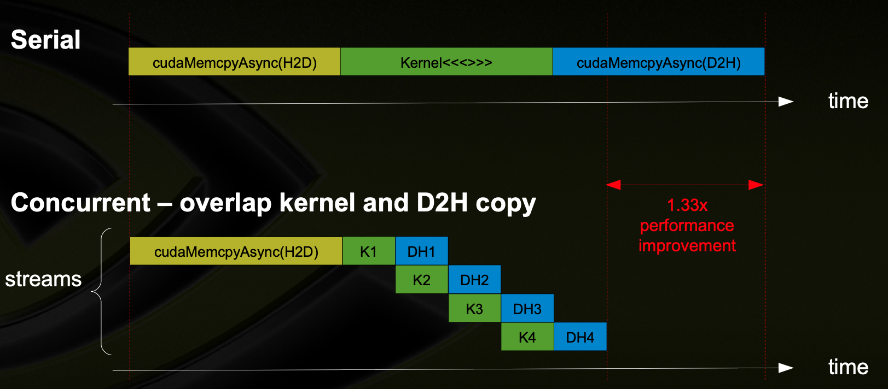

Asynchronous CUDA Calls
========================

.. admonition:: Overview
   :class: Overview

    * **Time:** 60 min

    #. Learn how to use asynchronous CUDA APIs to improve performance.
    #. Understand the concept of CUDA streams and how they can be used to overlap memory transfers and kernel execution.

This section provides an example of how to use asynchronous CUDA APIs to improve the performance of a simple vector addition program. 
By using CUDA streams, we can overlap memory transfers and kernel execution, leading to better GPU utilization.

CUDA Streams
-----------------------------

A stream is a sequence of operations that execute on the GPU in the order they are issued. Streams allow for concurrent execution of multiple operations, such 
as memory transfers and kernel launches, which can significantly improve performance by overlapping computation and data transfer.

Streams are particularly useful in scenarios where you want to perform multiple operations on the GPU without waiting for each operation to complete before 
starting the next one. By using streams, you can maximize the utilization of the GPU and reduce idle time.

Why streams result in more concurrency?
-----------------------------

1. Streaming Multiprocessors (SMs)

    * GPUs contain multiple Streaming Multiprocessors (SMs).
    * Each SM can execute threads from different kernels concurrently, as long as there's enough space and resources (registers, shared memory, etc.).
    * So parallel kernel launches can utilize multiple SMs, allowing for more threads to be executed simultaneously.

2. Separate Engines for Compute and Memory Operations

    * GPUs have separate engines for memory operations (like `cudaMemcpyAsync`) and compute operations (like kernel launches).
    * This means that while one stream is executing a kernel, another stream can perform memory transfers without waiting for the first to finish.
    * This overlap allows for better utilization of the GPU's resources.

For efficient and proper use of streams, it's important to ensure that

* The GPU must support concurrent kernel execution.
* There must be no resource conflict (e.g., using different memory regions).
* Streams must be independent — no implicit synchronization (e.g., from using the default stream).

.. important::

   Streams are not a replacement for parallelism; they are a way to manage concurrency on the GPU. You can have multiple streams executing concurrently, 
   but each stream's operations will still be executed in order.

Main differences from the synchronous version
---------------------------------------------

* Create and use a CUDA stream with ``cudaStreamCreate()``.
* Use ``cudaMemcpyAsync()`` for asynchronous memory copies.
* Launch the kernel in the created stream.
* Synchronize the stream with ``cudaStreamSynchronize()`` to wait for completion.
* Cleanup the stream after use.

.. important::

    ``cudaMalloc`` and ``cudaFree`` are still synchronous operations, meaning they block the host until the memory allocation or deallocation is complete.

.. code-block:: cpp

    #include <stdio.h>
    #include <cuda_runtime.h>

    // Kernel 1: Adds 1 to each element
    __global__ void kernel1(float* data, int n) 
    {
        int idx = blockIdx.x * blockDim.x + threadIdx.x;
        if (idx < n)
            data[idx] += 1.0f;
    }

    // Kernel 2: Multiplies each element by 2
    __global__ void kernel2(float* data, int n) 
    {
        int idx = blockIdx.x * blockDim.x + threadIdx.x;
        if (idx < n)
            data[idx] *= 2.0f;
    }

    int main() 
    {
        const int n1 = 512;
        const int n2 = 512;
        const int size1 = n1 * sizeof(float);
        const int size2 = n2 * sizeof(float);

        float *h_data1 = (float*)malloc(size1);
        float *h_data2 = (float*)malloc(size2);

        // Initialize host data
        for (int i = 0; i < n1; i++) h_data1[i] = i;
        for (int i = 0; i < n2; i++) h_data2[i] = i * 10;

        float *d_data1, *d_data2;
        cudaMalloc(&d_data1, size1);
        cudaMalloc(&d_data2, size2);

        cudaStream_t stream1, stream2;
        cudaStreamCreate(&stream1);
        cudaStreamCreate(&stream2);

        // Copy and launch kernel on stream1
        cudaMemcpyAsync(d_data1, h_data1, size1, cudaMemcpyHostToDevice, stream1);
        int threads = 256;
        int blocks1 = (n1 + threads - 1) / threads;
        kernel1<<<blocks1, threads, 0, stream1>>>(d_data1, n1);

        // Copy and launch kernel on stream2
        cudaMemcpyAsync(d_data2, h_data2, size2, cudaMemcpyHostToDevice, stream2);
        int blocks2 = (n2 + threads - 1) / threads;
        kernel2<<<blocks2, threads, 0, stream2>>>(d_data2, n2);

        // Copy results back asynchronously
        cudaMemcpyAsync(h_data1, d_data1, size1, cudaMemcpyDeviceToHost, stream1);
        cudaMemcpyAsync(h_data2, d_data2, size2, cudaMemcpyDeviceToHost, stream2);

        // Wait for streams to finish
        cudaStreamSynchronize(stream1);
        cudaStreamSynchronize(stream2);

        // Print some results
        printf("Stream 1 results:\n");
        for (int i = 0; i < 5; i++) printf("h_data1[%d] = %f\n", i, h_data1[i]);

        printf("Stream 2 results:\n");
        for (int i = 0; i < 5; i++) printf("h_data2[%d] = %f\n", i, h_data2[i]);

        // Cleanup
        cudaStreamDestroy(stream1);
        cudaStreamDestroy(stream2);
        cudaFree(d_data1);
        cudaFree(d_data2);
        free(h_data1);
        free(h_data2);

        return 0;
    }

.. list-table::
   :header-rows: 1
   :widths: 30 70

   * - API
     - Purpose
   * - ``cudaMemcpyAsync``
     - Starts a memory copy asynchronously and returns immediately.
   * - ``cudaStream_t``
     - Represents a CUDA stream (a queue of commands executed in order).
   * - ``cudaStreamCreate()``
     - Creates a new CUDA stream.
   * - ``cudaStreamSynchronize()``
     - Blocks host until all commands in the stream have completed.
   * - ``cudaStreamDestroy()``
     - Destroys the CUDA stream and frees associated resources.

.. admonition:: Key Points
   :class: hint

    #. Asynchronous CUDA APIs allow overlapping memory transfers and kernel execution.
    #. CUDA streams enable concurrent execution of multiple tasks on the GPU.
    #. Proper synchronization is crucial to ensure data integrity and correctness.
    #. Cleanup of streams and device memory is necessary to avoid resource leaks.