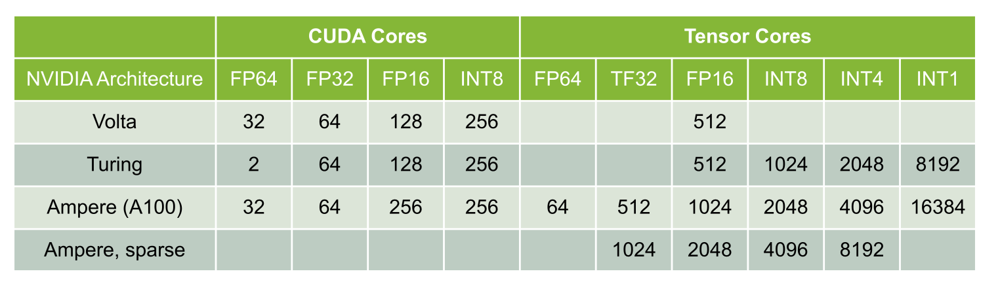

Graphics Processing Unit (GPU) 
========================================

.. admonition:: Overview
   :class: Overview

    * **Time:** 30 min

    #. Learn what a GPU is and how it differs from a CPU.
    #. Learn the basic architecture of a GPU.
    #. Learn how one vendor differs from another.

GPU Overview
----------------------------
A Graphics Processing Unit (GPU) is a specialized processor designed to accelerate computations. Unlike a Central Processing Unit (CPU), which is 
optimized for general-purpose tasks, a GPU is optimized for parallel processing, making it particularly effective for tasks that can be performed cuncurrently.

.. important::

   Concurrency is the ability to perform multiple tasks simultaneously, while parallelism is the simultaneous execution of multiple tasks.
   All cincuurrent tasks are not parallel, but all parallel tasks are concurrent.

A GPU is not a replacement for a CPU, but rather a complementary processor that can significantly speed up certain types of computations, especially those 
involving large datasets or complex mathematical operations.

CPU vs GPU
----------------------------

A CPU is designed for general-purpose computing and is optimized for tasks that require high single-threaded performance. It has a few cores (typically 4 to 16)
that can handle multiple threads, but it is not optimized for parallel processing. In contrast, a GPU has thousands of smaller cores that can handle many 
threads simultaneously, making it ideal for tasks that can be parallelized.

.. list-table:: Difference Between CPU and GPU
   :widths: 25 75
   :header-rows: 1

   * - Feature
     - CPU (Central Processing Unit)
     - GPU (Graphics Processing Unit)

   * - Purpose
     - General-purpose processing, suitable for diverse tasks and system control.
     - Specialized for parallel data processing and graphics computations.

   * - Core Count
     - Few powerful cores (typically 4–16).
     - Thousands of smaller, simpler cores.

   * - Thread Handling
     - Handles a few threads efficiently.
     - Handles thousands of threads simultaneously.

   * - Performance Focus
     - High single-thread performance; optimized for latency.
     - High throughput; optimized for parallelism.

   * - Task Type
     - Suited for tasks requiring complex logic and decision making.
     - Suited for repetitive, highly parallel tasks (e.g. matrix operations, image processing).

   * - Memory Hierarchy
     - Large cache per core, complex memory hierarchy for low-latency access.
     - Smaller cache per core, optimized for high memory bandwidth.

   * - Power Consumption
     - Generally lower power for basic operations.
     - Higher power usage due to many cores and high throughput.

   * - Example Applications
     - Operating systems, office software, web browsing, database management.
     - Deep learning, scientific simulations, image/video processing, 3D rendering.

GPU Architecture
----------------------------

.. admonition:: Explanation
   :class: attention

   Gadi only has NVIDIA GPUs. So when we say GPUs we mean NVIDIA GPUs. Nevertheless, most concepts discussed here 
   are the same across different vendors. 

GPUs are composed of multiple Streaming Multiprocessors (SMs), an on-chip L2 cache, and high-bandwidth DRAM. 

   GPU Architecture

Modern NVIDIA GPUs use a hierarchical memory and compute architecture designed for high throughput and parallelism. This document explains the roles of:

* Streaming Multiprocessors (SMs)
* CUDA cores
* L1 and L2 caches

These components work together to accelerate parallel tasks such as scientific computing, deep learning, and graphics rendering.

Streaming Multiprocessors (SMs)
-------------------------------

.. list-table::
   :header-rows: 1
   :widths: 25 75

   * - Feature
     - Description
   * - Definition
     - A Streaming Multiprocessor is the basic unit of computation in an NVIDIA GPU.
   * - Contains
     - Multiple CUDA cores, L1 cache, warp schedulers, registers, and shared memory
   * - Responsibility
     - Executes multiple warps (groups of 32 threads) in parallel
   * - Independent Execution
     - Each SM can execute multiple thread blocks concurrently (if resources allow)
     
CUDA Cores
----------

.. list-table::
   :header-rows: 1
   :widths: 25 75

   * - Feature
     - Description
   * - Definition
     - The smallest execution units inside an SM
   * - Function
     - Execute arithmetic and logic instructions for individual threads
   * - Number per SM
     - Varies by architecture (e.g., 64 in Volta, up to 128 or more in newer GPUs)
   * - Highly Parallel
     - Thousands of CUDA cores on a GPU enable massive parallel execution

While CUDA cores are often thought of as "identical tiny processors," in practice, not all CUDA cores are the same in capability or function, especially 
within an SM (Streaming Multiprocessor). 

   CUDA Cores

CUDA cores are primarily designed to handle:

* Integer operations
* 32-bit floating-point (FP32) arithmetic

However, other types of operations like:

* 64-bit floating point (FP64)
* Tensor operations (for AI)
* Special function math (e.g., sin, sqrt)

For example:

* Multiply two FP32 arrays → goes to CUDA cores
* Apply sin() → goes to SFU (Special Function Unit)
* Multiply matrices → goes to Tensor cores 

L1 Cache (Level 1)
------------------

.. list-table::
   :header-rows: 1
   :widths: 25 75

   * - Feature
     - Description
   * - Scope
     - Private to each Streaming Multiprocessor (SM)
   * - Latency
     - Very low
   * - Size
     - 192 - 256 KB depending on the GPU architecture
   * - Usage
     - Stores frequently accessed data by threads in a block; shared with shared memory
   * - Functionality
     - Reduces traffic to global memory and accelerates spatially local data access

Note: In recent architectures like Ampere and Hopper, L1 cache is unified with shared memory, allowing configurable allocation between them.

L2 Cache (Level 2)
------------------

.. list-table::
   :header-rows: 1
   :widths: 25 75

   * - Feature
     - Description
   * - Scope
     - Shared across all SMs
   * - Latency
     - Higher than L1, but much lower than global memory (DRAM)
   * - Size
     - 40 - 50 MB depending on the GPU architecture
   * - Usage
     - Caches global memory accesses for all SMs
   * - Coherency
     - Coherent across all SMs — changes made in one SM are visible to others

Difference Between Shared Memory and DRAM
-------------------------------
Shared memory and DRAM (Global Memory) are two types of memory used in NVIDIA GPUs, each serving different purposes and having distinct characteristics.

.. list-table:: Shared Memory vs DRAM in NVIDIA GPUs
   :widths: 25 37 37
   :header-rows: 1

   * - Feature
     - Shared Memory
     - DRAM (Global Memory)

   * - Location
     - On-chip (inside SM)
     - Off-chip (external to SM)

   * - Scope
     - Accessible to threads in the same block
     - Accessible by all threads across all blocks

   * - Latency
     - Low (~10–50 cycles)
     - High (~400–800 cycles)

   * - Size
     - Small (typically 48–96 KB per SM)
     - Large (several GBs)

   * - Access Speed
     - Very fast
     - Slower, but cached via L2

   * - Programmer Control
     - Yes (explicitly allocated and managed)
     - No (only allocate/read/write)

   * - Use Case
     - Thread cooperation, temporary data sharing
     - Input/output, persistent global data

How They Work Together
-------------------------------

1. **Threads** are scheduled and executed on **CUDA cores** inside an **SM**.
2. Each **SM** has fast **L1 cache** and access to configurable **shared memory**, which helps speed up local computation.
3. Data not found in L1 is fetched from the **L2 cache**, which acts as a buffer before accessing **global memory** (DRAM).
4. This hierarchy helps reduce latency, increase memory throughput, and enable high-performance parallel execution.

.. admonition:: Key Points
   :class: hint

    #. A GPU is a specialized processor designed for parallel processing.
    #. It has thousands of smaller cores optimized for concurrent tasks.
    #. The architecture includes Streaming Multiprocessors (SMs), CUDA cores, and multiple levels of cache.
    #. GPUs are not a replacement for CPUs but complement them for specific tasks.

